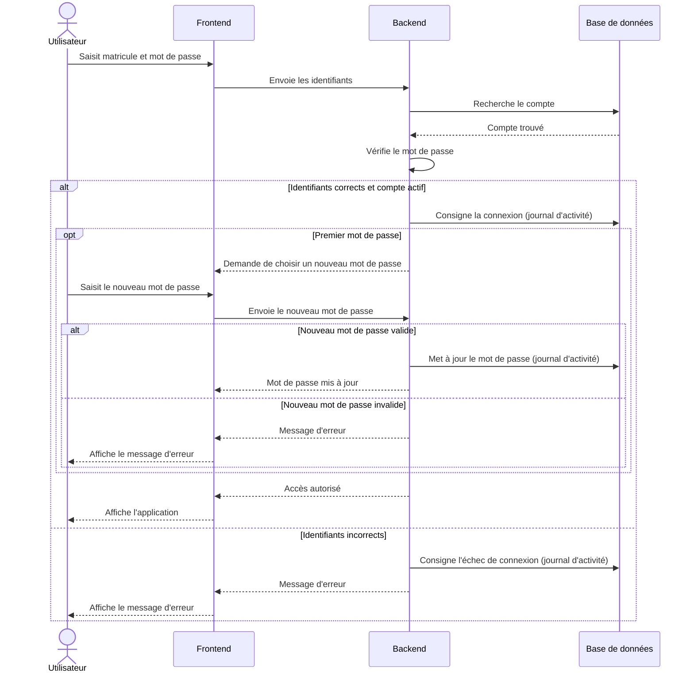
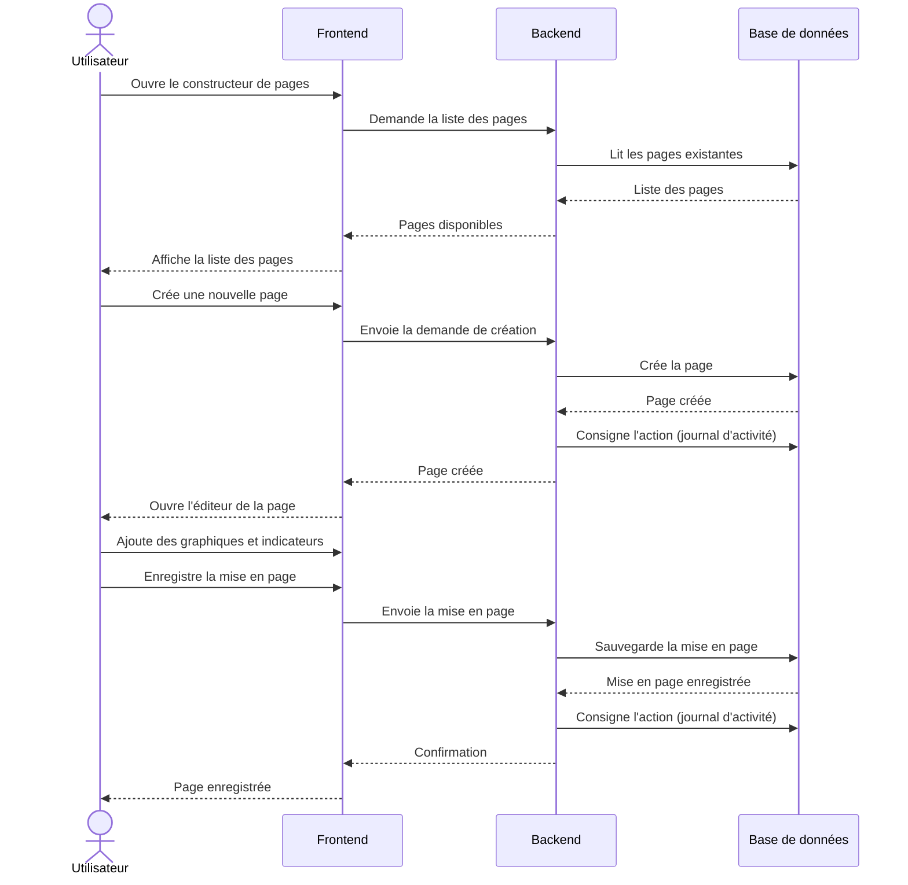
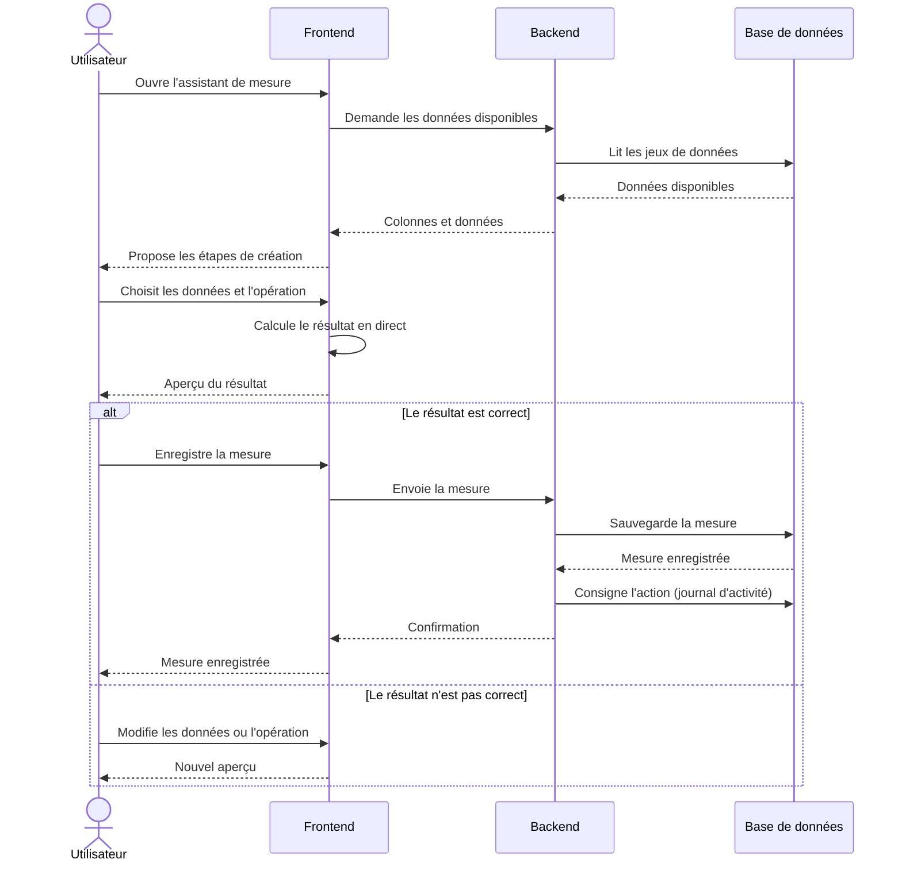
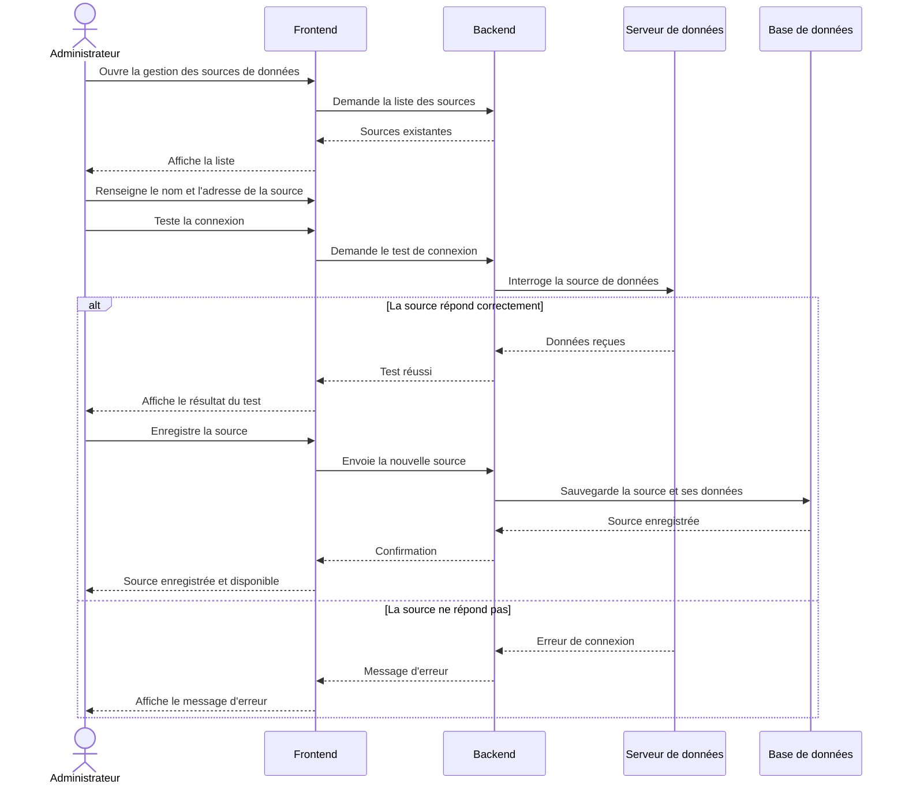
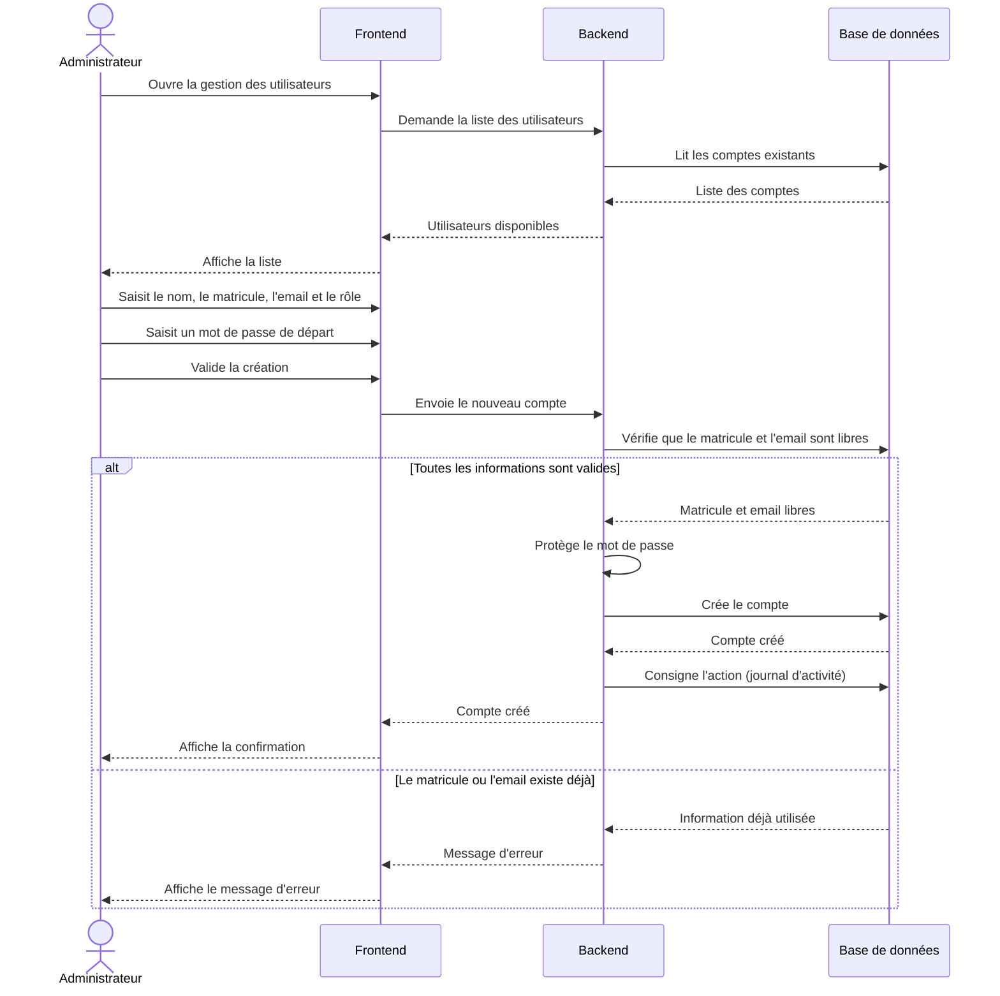

# Diagrammes de séquence — BACOVET

Version simplifiée des parcours les plus importants, écrite pour des
utilisateurs non techniques. Chaque diagramme montre le chemin complet d'une
action : l'écran (Frontend), le serveur (Backend) et la base de données.

Format PlantUML : `sequence-diagrams.puml`.

## Acteurs et systèmes

| Personnage | Rôle |
| ---------- | ---- |
| **Utilisateur** / **Administrateur** | la personne qui agit |
| **Frontend** | l'écran affiché dans le navigateur (l'interface) |
| **Backend** | le serveur de l'application (les règles, la sécurité, le calcul) |
| **Base de données** | le stockage permanent des informations |
| **Serveur de données** | la source externe de données (uniquement diagramme 4) |

## Notation

| Symbole | Signification |
| ------- | ------------- |
| `->`    | Une action (une demande envoyée) |
| `-->`   | Une réponse / un retour d'information |
| `alt … else` | Deux scénarios possibles : le cas normal et le cas d'échec |
| `opt`   | Une étape optionnelle qui n'a lieu que dans certaines situations |

---

## 1. Connexion et premier changement de mot de passe

L'utilisateur saisit son matricule (ou son email) et son mot de passe. Le
serveur vérifie le compte en base de données. À la toute première connexion,
le serveur demande de choisir un nouveau mot de passe avant d'ouvrir l'accès.

---

## 2. Créer ou modifier une page de tableau de bord

L'utilisateur ouvre le constructeur de pages, crée une nouvelle page, y
place ses graphiques et indicateurs, puis enregistre sa mise en page. Chaque
étape passe par le serveur et la base de données.

---

## 3. Créer une mesure avec l'assistant

L'assistant guide l'utilisateur pour construire un indicateur (mesure). Il
choisit ses données parmi celles disponibles, puis voit le résultat en
direct avant de l'enregistrer.

---

## 4. Créer une source de données (endpoint)

L'administrateur enregistre une nouvelle source de données : il renseigne
son adresse, la teste auprès du serveur de données, puis l'enregistre pour
qu'elle soit disponible dans les tableaux de bord.

---

## 5. Ajouter un utilisateur

L'administrateur crée un compte pour un nouvel utilisateur : il renseigne
ses informations, le rôle et un mot de passe de départ. Le serveur vérifie
que les informations sont uniques, enregistre le compte et trace l'action.

